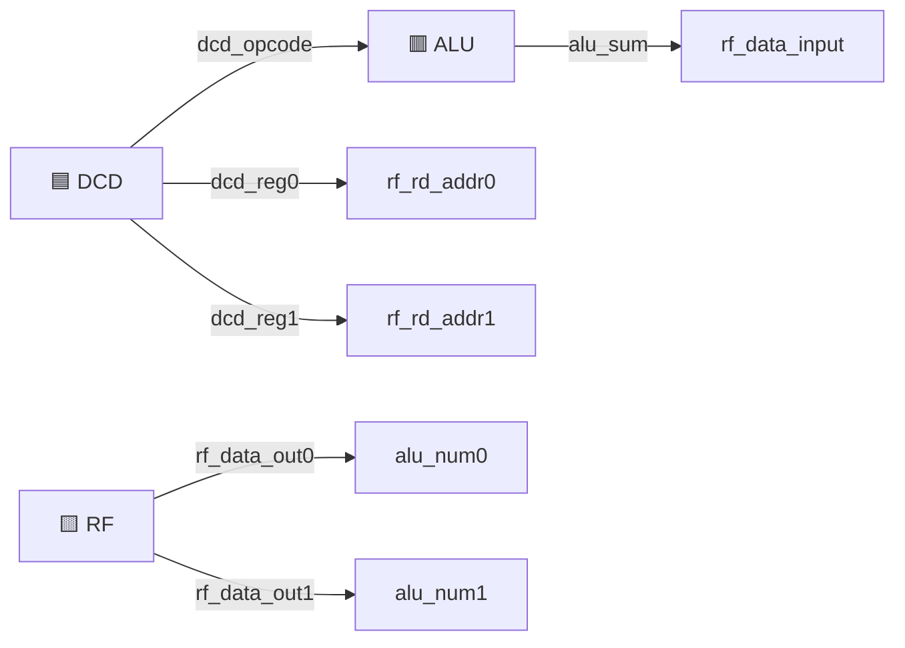

```mermaid
flowchart LR
    DCD[🟦 DCD] -->|dcd_opcode| ALU[🟥 ALU]
    DCD -->|dcd_reg0| RF_A0[rf_rd_addr0]
    DCD -->|dcd_reg1| RF_A1[rf_rd_addr1]

    RF[🟨 RF] -->|rf_data_out0| ALU_N0[alu_num0]
    RF -->|rf_data_out1| ALU_N1[alu_num1]

    ALU -->|alu_sum| RF_DIN[rf_data_input]
```
